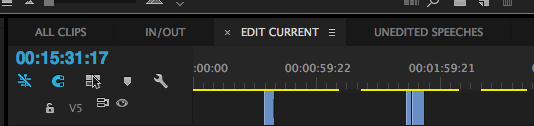
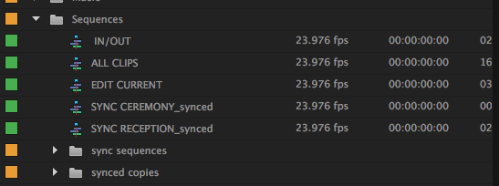

## Standards Everywhere
Like many things, coding standards seem trivial on a small scale. However, small things like indentation and curly braces matter in the long run, and matter when working with other people. It’s understandable to think that the amount of spaces you need to put after a line of code can seem silly, but it’s necessary to create quality programs. Large projects and ideas are ultimately the result of a lot of little good habits and practices. These habits are the glue that hold everything together.

## Grammar Police
You wouldn’t read a book or online article that had commas in the wrong places, no spaces between any of the words, or run on sentences, would you? I guess maybe some people would trek through that run-on sentence, but I don’t think anyone would find readingasentencewithoutanyspacesenjoyable. Books such as Harry Potter, and Lord of the Flies wouldn’t really exist without the simple rules of punctuation and grammar. There would be no agreed upon way of writing and reading things. This is the same case with software engineering and coding standards. If there was no standard way to write a certain line of code, we probably would not have apps like uber or twitter. We need some basic building block rules, in order to create our most ambitious projects. 

## Standards in Wedding Video Editing
I work part time as a video editor for a wedding cinematography company. The process involves me creating a rough draft of the edited video, sending it to my boss for him to review, him sending it back to me to revise, me revising the video, and sending it back for him to export the final cut. Many problems can arise within these few steps, so we essentially setup a few unofficial standards of our own in order get things done efficiently. Some of these standards even have similarities with how coding standards are done. 

For example, I would always name the current version of the video that I am editing “EDIT CURRENT” because there are usually multiple versions of the cut.

This is useful because it’s very easy to accidentally make changes to an old version of the edit instead of the current version. Another example is I always create copies of these particular sequences that contain the “formal events” of the wedding. These sequences contain synced up camera angles, and somewhere down the line when I’m editing, something goes out of sync and I have to replace it. 

Essentially, I always create a backup copy of this all the time, even if it may not be needed. There are many more examples that I could list but that’s the general idea of my personal standards in video editing. Without these standards, a simple mistake can lead to a lot of wasted time. Much like coding standards, these editing standards also makes it easier on someone else looking at the project.

## Good Standards = Good Habits = Good Software Engineering
You have to be able to crawl before you can walk, and you have to be able to walk before you can run. Coding standards are necessary for good software engineering because not only does it allow us to work more efficiently, but it also allows us to work more efficiently with others.
Good coding standards will go a long way, and I believe if you stick with it, you’ll soon be on your feet making the programs you want to make.
