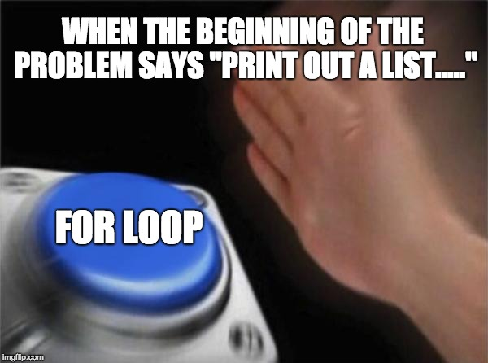

## The parents that get you out of trouble
Design patterns are the parents that get you out of trouble when you have a flat tire for the first time in your life and you have no idea what you are doing. They are the voice of reason from an older friend when you are panicking about decisions about your future. They are also the recipe on the back of the box so you don't need to figure out how much pancake mix and how much water you need to make a bunch of pancakes. Design patterns are templates or plans that were created by people that have gone through the trial and error of figuring out tough problems on their own, so that future people don't need to stress over exactly how much pancake mix you need to pour into the measuring cup. Design patterns are also like a local that's giving you directions to the entrance of a hiking trail that's really hard to find. Instead of having to spend a lot of time looking it for yourself, the local can point you in the correct direction immediately.

## Reinventing the Wheel
 Not only are design patterns extremely helpful to people that are entirely new to a given situation so that they don't need to go through all the hurt and pain that they went through, but they are also helpful to the people that already know how to solve the specific problem, but they find themselves having to solve the problem over and over again. So they create a design pattern to help themselves and other people that need quick solutions to similar problems. Much like how there are many technologies we use today that solve the problems that people before us used to face such as our use of electricity, cars, and the Internet. Back then, people would need to light lamps in their room just to write letters to people, and those letters would be sent by the use of a man riding in a horse carriage. At some point someone said, man this kind of sucks. I wish there was some way convenient way to do all of these things. Then just a couple of people created solutions to these problems, and now many use these innovations without even having to know how it works. But that's a good thing because without these innovations I would have to worry annoying things like gathering oil for my lantern, or making sure my horses are well fed rather than focusing on my computer science homework.

 

## What's a for loop? 
Back when I was learning about loops in my first college programming class, I didn't know yet how ubiquitous loops were going to be in upcoming classes. I remember my first time looking at how to write a for loop in Java and thought to myself that there was no way I'm going to remember how to write all that stuff inside those parentheses. But I had to learn how to write it, and there was no escaping it because I just wrote it so much, almost as if it was some kind of design pattern or something. When it comes to design patterns, the for loop is the only real example I can think of that I have come across in my college career. At this point in my college career I realize that a for loop isn't the only solution to printing out a list but early in my college career I would automatically think "for loop" as soon as the problem mentioned some sort of list. A for loop is generally a common way to solve the problem of printing out a list of a bunch of stuff. Printing lists out is a very common problem, so it makes sense that there is a design pattern for it.

## Patterns show you the way
Design patterns lend a helping hand in your time of need. They let you deal with the harder problems like whether or not P = NP instead of figuring out how to print out a list in alphabetical order. Without design patterns we would all be taking a shot in the dark every time we tackle a new problem and that wouldn't be very productive. Design patterns are the blueprints that are leftover by the master architects of solutions to the hard problems. We are able to move forward and solve the even harder problems thanks to design patterns. 

