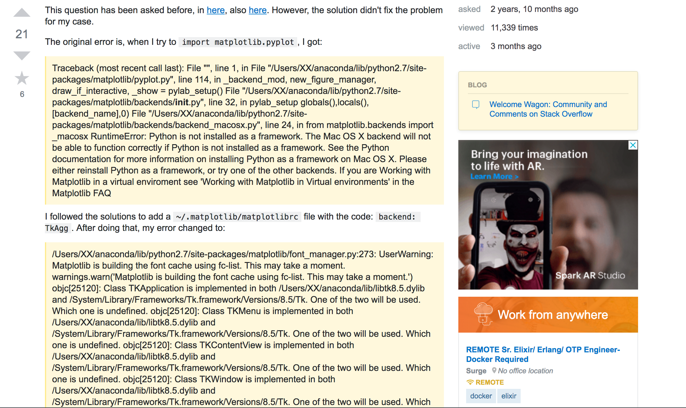
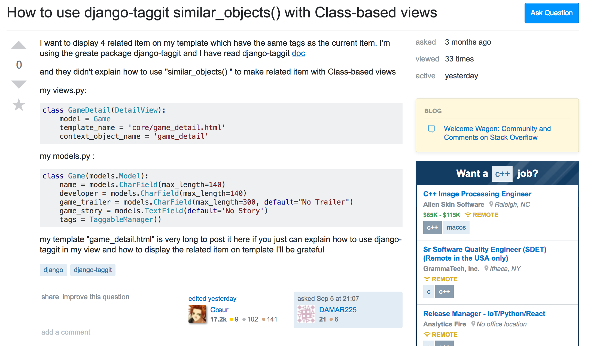

## Finding Good Answers Require Hard Work
Often times when I come across a problem in a programming assignment, I immediately think to myself that it's the end of the world and that I'm never going to finish the assignment. I make some kind of attempt to look for a solution on google, but it's a very lazy attempt. I would click on the first two search results and be frustrated that I have to spend time searching for a solution instead of spend time typing out code. I think that's why it's hard to ask good questions. By the time we come across a problem in our code, we have already exhausted a good amount of our mental effort thinking about the design of the program in our head, and actually typing it out. At that point we just want a get-out-of-jail-free card that will save us from this unexpected inconvenience, so we either do a lazy google search, or ask lazy questions. Doing thorough web searches or formulating a detailed question takes even more mental effort. Eric Raymond goes into detail in an <a href="http://www.catb.org/esr/faqs/smart-questions.html">essay</a> on how to ask smart questions. 

## The Steps to Ask Good Questions
Essentially there are three main things to keep in mind when formulating good questions as a smart software engineer. You must first know all details about your problem to that you can be as specific as possible when you research it. The next step once you fully know your problem is to do some thorough research including tactics outlined by Raymond including searching for your question on forums as it may have already been answered, checking the FAQ, and taking note of anything potentially useful even though it does not directly solve your problem. The last step once you have done everything you can to attempt to solve your problem, is to formulate your question on an appropriate forum where the question is relevant and has not been asked before. 

## Difference in Questions on Stack Overflow
Looking at a couple of examples on stack overflow, we can see the difference in the quality of the question and the number of answers. <a href="https://stackoverflow.com/questions/34977388/matplotlib-runtimeerror-python-is-not-installed-as-a-framework">In this particular question</a>, the user does several things to create a good post. The first thing the user does is they point out that the question has been asked and answered a couple times before, but that it doesn't work for their case. This shows that they have put in the effort to attempt to solve their problem rather than just asking for an answer. They also explain a specific error they get when they do a specific thing, and also show what solutions they have tried and the result of that. They received a couple good answers because they showed that they put in the effort before they posted their question. In contrast, <a href="https://stackoverflow.com/questions/52193393/how-to-use-djnago-taggit-similar-objects-with-class-based-views">this question doesn't seem to follow all of the steps. </a> It seems that they are just asking how to use a specific function, they do post a snippet of their code but probably is not much help considering there were no answers. This user seems to just be flat out asking for an explanation to be given to them, rather than doing the work themselves. 

## Smart Software Engineers
To be able to ask good questions is as valuable as finding good answers, if not it's even more valuable. Asking good questions allows everyone involved to potentially learn something new because it could either question what we already know, or can confirm what not to do. Asking smart questions is necessary as a software engineer because it will help you out, and it will also help out others. 