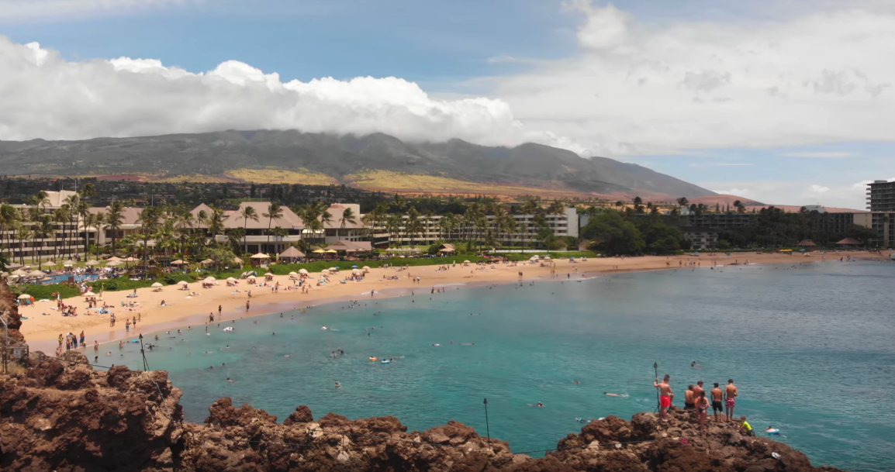
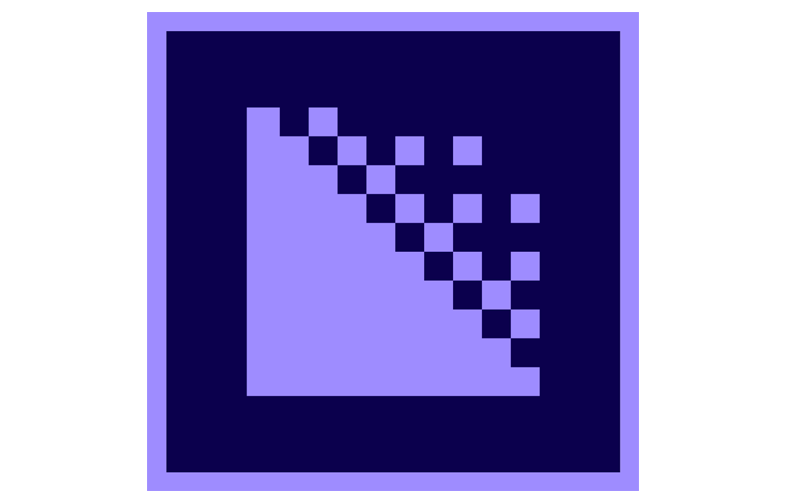

Cinematography is one of my many passions, so I bought a drone in June of 2018 while I was back home in Maui for the summer. I bought the DJI Mavic Air which is a consumer-level drone that was announced by DJI in the beginning of 2018, and is one of DJI's best drones in my opinion. The Mavic Air can shoot in 4K video resolution and can shoot up to 120fps. 

After getting this drone I set out to create a short drone reel that would show off pretty much all of Maui and its beauty. So in June and July, I went to different locations all over Maui and got drone footage of all of Maui's famous locations such as Black Rock in Kaanapali, Big Beach in Makena, and Hookipa at the North Shore. In those two months I learned a lot about flying my drone. I learned how to use the built in flying modes such as obstacle avoidance and tracking modes. I also learned the difference between using a 2.4GHz or 5.8 Ghz wifi signal to control the aircraft. 

I shot all of those clips at a resolution of 4K. After editing some of the footage in Adobe Premiere Pro, I quickly realized that my Macbook Pro simply can not edit 4K footage smoothly. Every time I would playback the footage, there would be at least a 3-5 second delay between me pressing play and the clip playing. This was a problem because having that much of a delay makes it almost impossible to edit all of my footage. To solve this problem, I needed to use another program called Adobe Media Encoder to create what was called proxy files. Proxy files are essentially video files that are downscaled to a lower resolution, making it way easier to playback and edit with. When the final edited video project is ready to export, Adobe Media Encoder replaces my proxy files with the full resolution 4k video files. 

In this personal drone project of mine, I not only learned how to use the DJI Mavic Air, but I also learned how to deal with full resolution 4K video files when editing. 
 
<a href="https://www.youtube.com/watch?v=lgoOUKRvinc"><i class="large youtube icon"></i>Watch my 3 minute video here!</a>