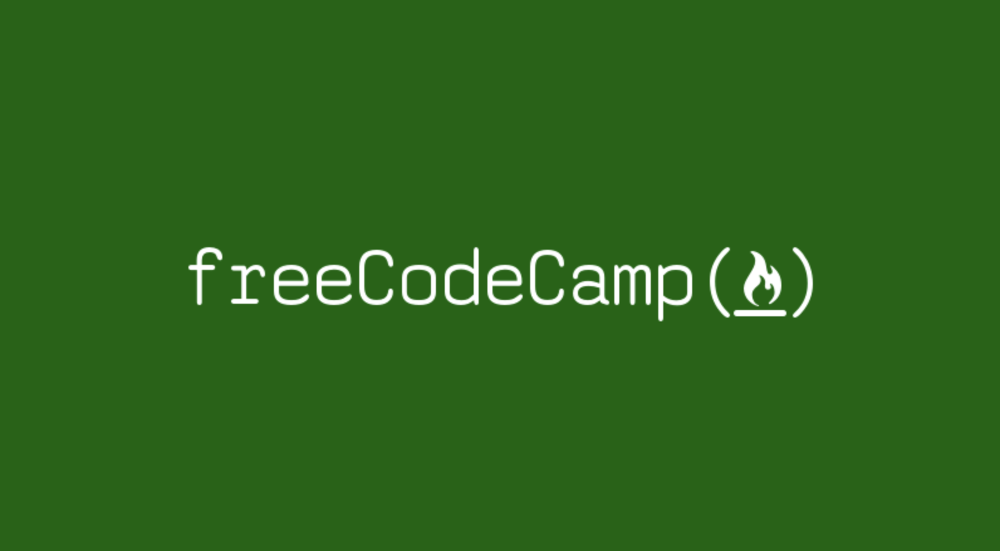

## Web Development Self Study Projects
During my final semester at UH Mānoa I decided that I wanted to focus on web development. I wanted to fill in the gaps in my knowledge of web development since I didn't do much of it during college, so I revisited my old freeCodeCamp account and  started from the beginning where I went through lessons on HTML, CSS, and Javascript while learning different concepts related to responsive web design. Then I learned some front end libraries such as React and Bootstrap. I am currently doing the data visualization projects where I use D3.js to create some data visualizations, and then next I will learn backend technologies like Node.js. All of these small projects were made in Codepen.

<a href="https://www.freecodecamp.org/willardperalta" target="_blank">A link to my freeCodeCamp profile!</a>

## All of my Codepens
I created all my small projects in Codepen, an interactive website where you can code small projects. These projects were part of the curriculum as well. The objective of these projects were to simply practice using the technologies that I learned in the freeCodeCamp tutorials. Different projects had varying levels of difficulty, below is my favorite one I've done so far! Below that are the rest of them.  

  See the Pen <a href="https://codepen.io/Willard_Peralta/pen/RwWdwBB">
  5/22/20 D3.js Heat map FCC</a> by Willard (<a href="https://codepen.io/Willard_Peralta">@Willard_Peralta</a>)
  on <a href="https://codepen.io">CodePen</a>.

## Responsive Web Design Projects
<a href="https://codepen.io/Willard_Peralta/pen/YzXZwQZ" target="_blank">Tribute Page</a> 
<a href="https://codepen.io/Willard_Peralta/pen/wvaeWzw" target="_blank">Survey Form</a> 
<a href="https://codepen.io/Willard_Peralta/pen/jOPwMEL" target="_blank">Product Landing Page</a> 
<a href="https://codepen.io/Willard_Peralta/pen/bGdRYzp" target="_blank">Technical Documentation Page</a> 
<a href="https://codepen.io/Willard_Peralta/pen/gOpRoyR" target="_blank">Portfolio Page</a> 

## Front End Library Projects (React)
<a href="https://codepen.io/Willard_Peralta/pen/WNQjvER" target="_blank">Random Quote Machine</a> 
<a href="https://codepen.io/Willard_Peralta/pen/ZEbKrqx" target="_blank">Markdown Previewer</a> 
<a href="https://codepen.io/Willard_Peralta/pen/MWamVzR" target="_blank">Drum Machine</a> 
<a href="https://codepen.io/Willard_Peralta/pen/xxwrmzR" target="_blank">Javascript Calculator</a> 
<a href="https://codepen.io/Willard_Peralta/pen/ZEbjpwO" target="_blank">React Pomodoro Clock</a> 

## Data Visualization Projects (D3.js)
<a href="https://codepen.io/Willard_Peralta/pen/oNjQEJo?editors=0110" target="_blank">Bar Chart of U.S. GDP Data 1945-2015</a> 
<a href="https://codepen.io/Willard_Peralta/pen/oNjmvyY?editors=0010" target="_blank">35 Fastest Professional Biking Times on a certain race track and corresponding dope usage</a> 
<a href="https://codepen.io/Willard_Peralta/pen/RwWdwBB?editors=0110" target="_blank">A Heatmap of global land surface temperature from 1753 - 2015</a> 

