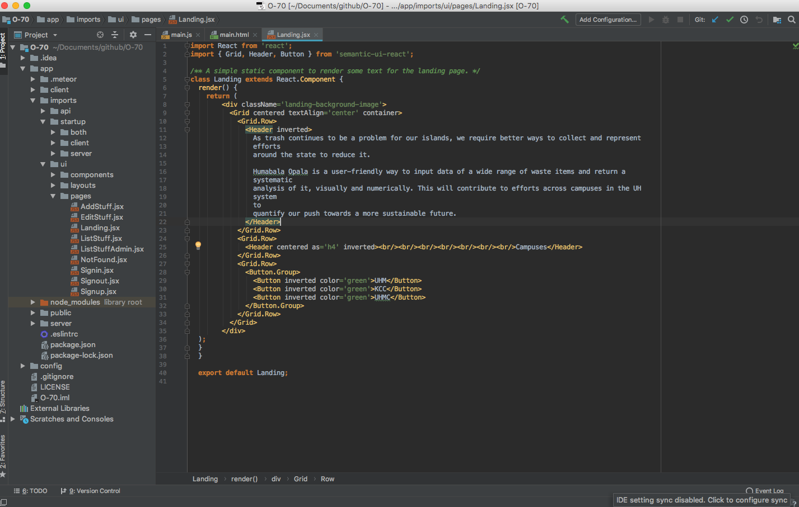

## My first hackathon
HACC 2018 stands for Hawaii Annual Code Challenge 2018. It is a hackathon on Oahu whose purpose is to engage the community in modernizing state government functions, processes, and services. It was the first ever hackathon that I participated in. There are different themes each year and this year's theme was about sustainability. HACC is different from most hackathons in that it is not a one or two day event, but rather spans over three weeks starting from kickoff day to final judging day. Open to people of all ages, participants would form teams and decide on a project that they want to work on for the next three weeks. Teams would pick projects on kickoff day where the sponsors would present their problem. Teams would need to meet the criteria that the sponsors specify, and if they make a working project by demo day, they would also need to create a presentation and video explaining their project. I formed a team with three of my friends who were also in computer science. We picked a project that involved creating a webapp for doing waste audits on UH campuses. Waste audits involve assessing trash bins around campus and counting different types of items people are throwing away, and using that data to analyze how we can improve recycling habits. The goal for our webapp was to create a better system for doing waste audits by creating a simple to use spreadsheet, and it would be a system available to all UH campuses. For all of us, this was our first time participating in a hackathon, and also our first time working on a coding project as a team. So we tried to create a project for the UH Waste Audit, but we ended up not finishing it because we ran out of time and realized that this project involved a lot more work than we thought it did. The image above is the result of our attempt at the project, this page would have been the home page of the project. All code was written in IntelliJ Idea as seen in the screen shot below.

## The process of team based software engineering
For the teams in HACC2018, someone needed to be designated as the team leader, so I was designated team leader for our team named O(70). Not only was this our first time working as a team on a coding project, but me and my other friend were the only two in the team that was at the time taking ICS314 which is a software engineering class that would be helpful to have been taking for a hackathon. It was helpful because we needed to know how to do things like use Github and how to deploy a webapp. But even though we were taking software engineering, it was still difficult because there were still things we didn't know how to do since we didn't complete the class yet. Two of my other friends on the team didn't even take ICS314 yet. Our whole process of working on the project basically depended on two days that we agreed we would meet on and that was every Thursday and Sunday. For the most part meetings weren't as productive as we hoped that they would be in terms of making progress on the actual webapp. For most of the meetings we were spending too much time figuring out how to do things rather than actually doing something. Me and my friend were trying to figure out how merge conflicts in Github worked for example, because this was our first time merging to a shared Github repo. I was also trying to figure out what my other two friends who didn't take ICS314 yet should do. For the most part they didn't really write much code but was spending more time learning how to do things like learn HTML. Considering all that, we were kind of at a disadvantage from the start looking back on it. In order to complete a project in 3 weeks we would have had to start on the first day with a running start. We were kind of just bumbling around 1 week in.

## I don't regret doing it
 Although my first hackathon experience wasn't all that successful, I don't regret doing it because I learned so much just from this one experience. I strongly believe in the saying that you learn the most from your failures because just from these three weeks alone, I feel that I've gained a lot of valuable insight. One of the main takeaways I got from my experience is that even though coding projects may seem easy and like they won't involve a lot of work, they can turn out to be more work than you anticipated because of unforeseen problems and vague requirements. I learned about unforeseen problems again in my final project for ICS314. A full blown coding project is not the same as a program you have to write for a homework assignment. A coding project has so many moving parts to it and many parts depend on one another. What we thought would be a simple app ended up being something we didn't even know how to finish. Another thing I learned was the importance of assigning roles in a team project. I got to appreciate this more during my final project for ICS314 where we actually assigned separate jobs for everyone in the team. Because of this hackathon, I can now appreciate breaking down tasks and assigning them to different people because now I know what it's like when you try to tackle everything at once. Everything was so overwhelming to us because of that, not only were we trying to figure stuff out, but we didn't know exactly what to start on because we didn't break the project down into tasks. From this event, I learned that there is a deliberate process when it comes to team based coding projects, as opposed to writing code blindly hoping that we can get it done in one week. Because of this event, I can now appreciate the systems that are in place whenever I work in a team setting.

 
<a href="https://github.com/HACC2018/O-70"><i class="large github icon"></i>Here is a link to our HACC2018 Github repo.</a>