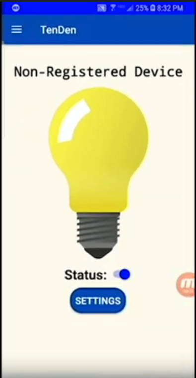

<a href="https://www.youtube.com/watch?v=72KMl0R_daQ">Here is the link to our demo video!</a> In it we do a walk through of our Android mobile app!

For my software engineering class II at UH Manoa, we were given a smart LED bulb and our assignment was to come up with some kind of feature that would alter the light bulb based on some kind of data it was given. We ended up using weather data to change the color of the light bulb.

The use can personalize settings for the light bulb by changing brightness and color temperature for a specific type of weather forecast such as cloudy or sunny. The user can also look for current weather data at any location by inputting a zip code. There is also feature that can alert the user of hazardous weather conditions, the light bulb will then flash every 30 seconds. Our app essentially tells the user what the weather is like anywhere in the world through the use of the Yeelight LED light bulb.

<a href="https://github.com/team-mjw/TenDenMobileApp"><i class="large github icon"></i>Link to the project repo!</a>
