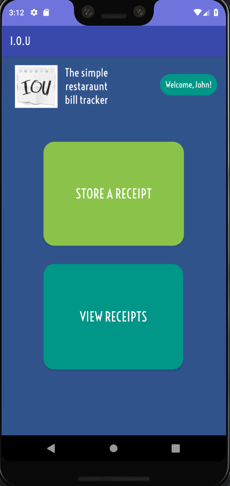

## Mobile Design
In my mobile design class at UH Mānoa, I developed an Android app with a partner called I.O.U. We needed to approach our app from an entrepreneurial perspective and target a specific audience, our specific demographic was college students that are part of large friend groups who eat out at restaurants often. <a href="../images/ics466_final_paper.pdf" target="_blank">Here is our in depth paper we wrote which goes into detail about the design, implementation, and results from peer evaluations. </a>

## About I.O.U.
Customers have the option to split a check at a restaurant. This means that a customer can ask the waiter to separate each person’s order so that each person only pays for what they got, rather than putting all the orders on one check and having one person pay it. This is often done specifically by college students because they are trying to save money. Only paying for what they ordered is beneficial to the whole group of students. However, depending on the restaurant or the number of people in the group, a restaurant will decide not to let a group separate a check into individual orders. There are different reasons for this but the main reason is because it can be a lot of work for the busy waiter to manually create separate receipts for everyone. This reason is especially true for large groups of people greater than ten. These large groups are common among college students because college students associate and interact through clubs or other school organizations such as marching band and sports. This situation will force one person to pay the entire bill before they leave the restaurant. Of course everyone will pay back the person for what they ordered, but again this can get complex with a large group of people. To add to the complexity, things get more complex when these large groups eat out often. This is the core issue the app, “I.O.U”,  intends to solve, tracking. Our app will help large student groups like this track what they owe, allowing the students to seamlessly pay each other back. <a href="https://github.com/willardperalta/ics466" target="_blank">Here's a link to our Github repo</a>

## Presentation Video
<iframe width="660" height="515" src="https://www.youtube.com/embed/yj4pDV237Ow" frameborder="0" allow="accelerometer; autoplay; encrypted-media; gyroscope; picture-in-picture" allowfullscreen></iframe>

