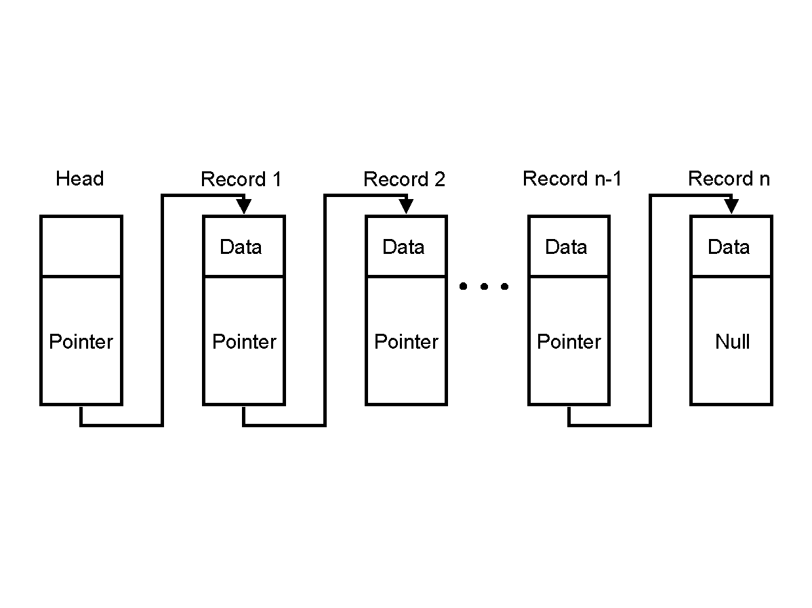

  

In my Program Structure class (ICS212) at UH Manoa, we were putting everything we learned about C together by creating a final project that involved using a linked list to implement a database program. The program allowed the user to add, remove, and print a list of records. Each record included an account number, name, address, and a pointer. By using pointers, I was able to create a linked list by referencing the next record using the previous record's pointer. The end of the list's pointer would point to NULL. 

Creating this program was a little frustrating because I didn't have any experience with C before I took this class. I learned about memory leaks and dangling pointers the hard way because of this project, but I am glad that I went through it.
