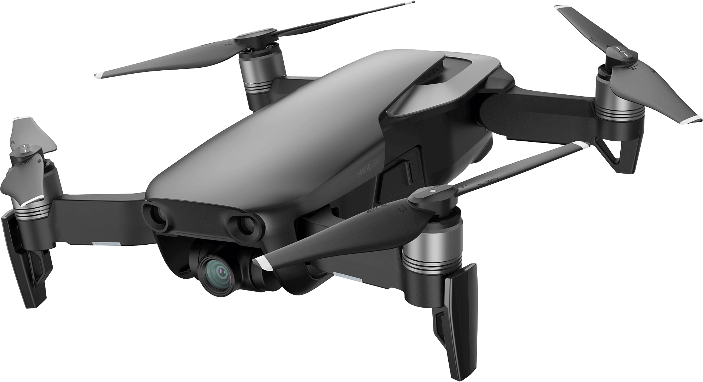

Cinematography is one of my many passions, so I bought a drone in June of 2018 while I was back home in Maui for the summer. I bought the DJI Mavic Air which is a considered a consumer-level drone that was announced by DJI in the beginning of 2018, and is one of DJI's best drones. The Mavic Air can shoot in 4K video resolution and can shoot up to 120fps. After getting this drone I set out to create a short drone reel that would show off pretty much all of Maui and its beauty. So over about 2 months in June and July, I went to different locations all over Maui and shot video of all of Maui's famous locations such as Black Rock in Kaanapali, Big Beach in Makena, and Hookipa in the North Shore.

I shot all of those clips at a resolution of 4K. After editing some of the footage in Adobe Premiere Pro, I quickly realized that my Macbook Pro simply can not edit 4K footage smoothly. Every time I would play along the footage, there would be at least a 3-5 second delay between me pressing play and the clip playing. This was a big problem because having that much of a delay makes it almost impossible to edit all of my footage. To solve this problem, I needed to create what was called proxy files. Proxy files are video files that are downscaled to a lower resolution to be used for editing, this way the I could easily cut through the footage. When the video was ready to export, Adobe Media Encoder automatically replaced my proxy files with the full resolution 4k video files.

In this personal drone project of mine, I not only learned how to use the DJI Mavic Air, but I also learned how to deal with full resolution 4K video files when editing. 
 
<a href="https://www.youtube.com/watch?v=lgoOUKRvinc"><i class="large youtube icon"></i>Watch the 3 minute video here!</a>