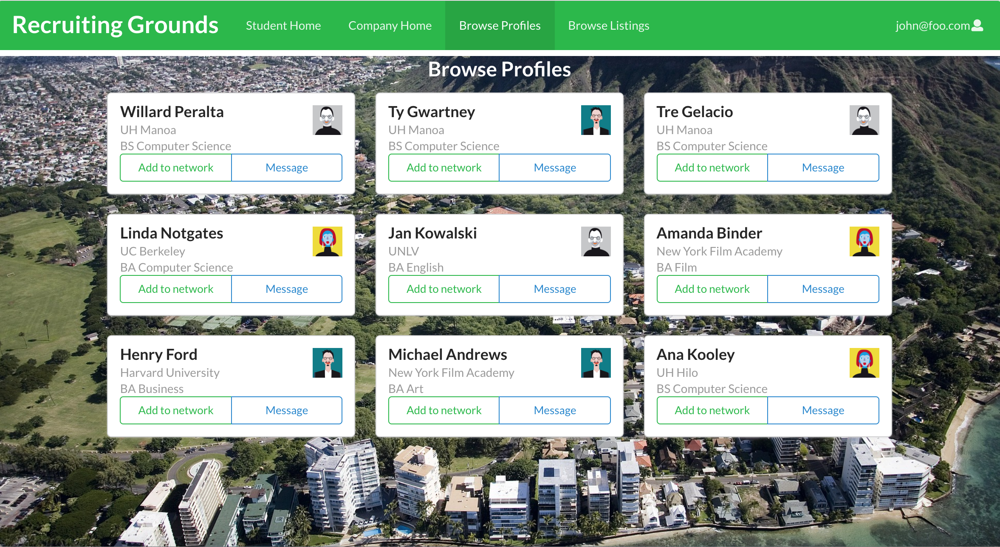

## Overview
For students, the process of finding internships and understanding the landscape of their field can be challenging because there is no central place to go to find opportunities. The same can be said about employers that are seeking interns or employees from colleges. Sending out mass emails through the college advisor is the usual method of contact, but is not really the most efficient. Built with Meteor, Recruiting Grounds is a social networking platform that connects companies and students who are seeking interns and internships. It creates a direct link between companies and students, allowing for a more efficient process. Either student or company can create an account, and can browse the listings for potential candidates. Users can add people to their network based on their interests and send them messages.

## The process and my contributions
My main contributions to the project included creating the project pages and submitting issues on our Github page. In order to track our progress, we made project boards in our organization Github page and created issues that we incrementally solved such as creating a login page, or changing the background picture of a certain page. I also set up the database and schema for the browse profiles page which was used to keep track of and store new profiles that were added. I created some mock up pages that were used at the start of the project to guide our ideas in what we wanted the site to look like before we actually implemented any of the features. Lastly I would be the one to deploy our website to Galaxy as we made updated versions. 

## What I learned
Working on a programming project in a team was something I have never done before, so that in itself was such a valuable experience for me. It was interesting to learn how Github has features like project pages, organizations, and issues in order to track the progress of the team's project. From using issues, I've learned that documenting the development experience is crucial because it records all stages of the project. It records where the project has been and it records where the project is going. That is important to facilitate good communication within the project team in order to get things done. Since this was my first time working in a development team, this was also my first time learning how to deal with merge conflicts using Github desktop and IntelliJ's built in solve merge conflicts feature. At first when I ran into merge conflicts I was hesitant to change anything in fear of breaking something, but now I am more comfortable in fixing problems as they come up. Along with the team aspect, I also learned a little more about the approach to developing a web app using a mix of tools like Meteor, React, and Mongo. This experience as a whole taught me a lot about software engineering and I'm glad that I went through it. 

 
<a href="https://github.com/twt-connections"><i class="large github icon"></i>Here is a link to our organization Github page with the project's source code.</a>