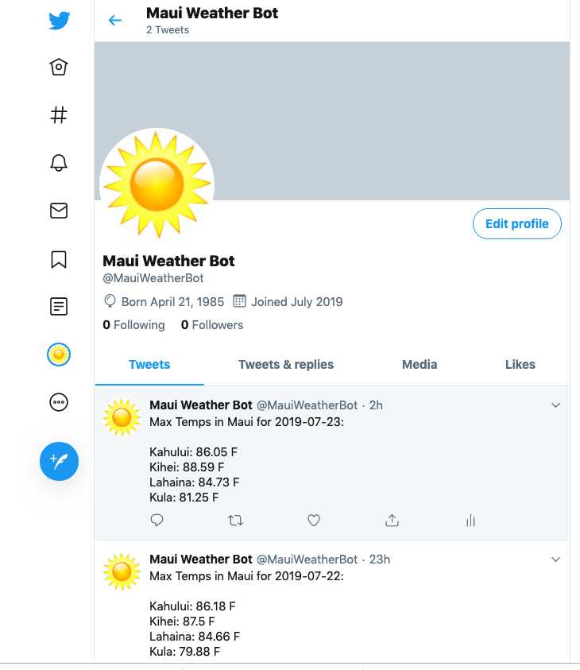

A simple Twitter bot using Dark Sky API, tweepy, and the Requests python package to tweet daily weather information for various areas around Maui. I used pythonanywhere.com to automatically send out a tweet at 7am daily.

Here is a link to my code
https://github.com/willardperalta/maui-weather-bot