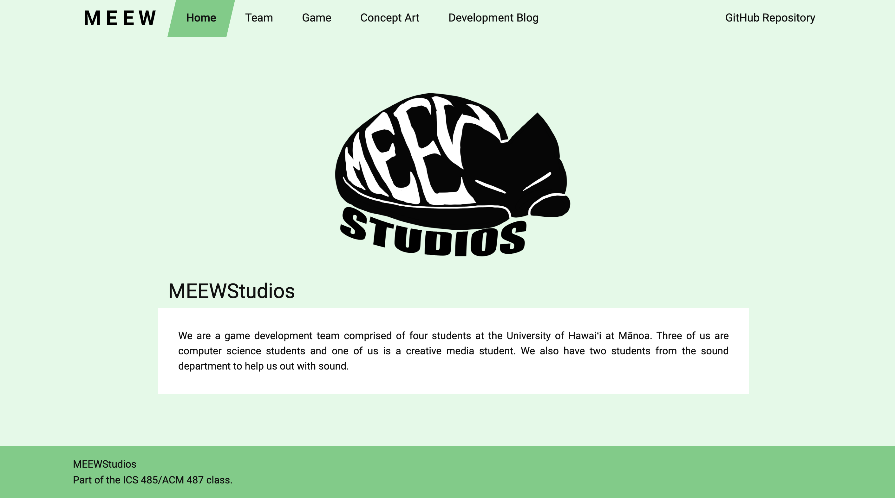

## Video Game Design in a team
In a development team of 4, we created Where's Ronaldo using the Unity Game engine for our video game design class. Art assets were created by our artist, and the developers wrote the game scripts in C#. We also had 2 students from a different music class create the music.

## About the game
Where’s Ronaldo is a competitive two to four player game in which players control a spotlight with the objective of locating the opponent’s elusive Ronaldo who can be found anywhere in a top down view of the level. A Ronaldo can be red, purple, blue, or green. Each player is assigned a Ronaldo on the map, if an opposing player finds an opponent’s Ronaldo and puts them under the spotlight for a few seconds, their Ronaldo is “captured” and the capturer starts gaining points over time! After a few seconds, a key will spawn on the map, the player who got captured must get the key in order to release their Ronaldo and stop the opponent from receiving points. Be carfeul becasue there are also fake imposter Ronaldos on the map who will decrease your score by a lot if you capture them! The players with the most amount of points within the two-minute time limit wins the round. In addition, players can use power-ups that will appear on the map to modify their spotlight and help them find Ronaldos faster.

<iframe width="560" height="315" src="https://www.youtube.com/embed/j_jjUtrEcGU" frameborder="0" allow="accelerometer; autoplay; encrypted-media; gyroscope; picture-in-picture" allowfullscreen></iframe>

<a href="https://meewstudios.github.io/microwalvo/" target="_blank">Our development team's website!</a> Our team name was MEEWStudios. Our website includes a development blog of the progress of our game throughout the semester.

