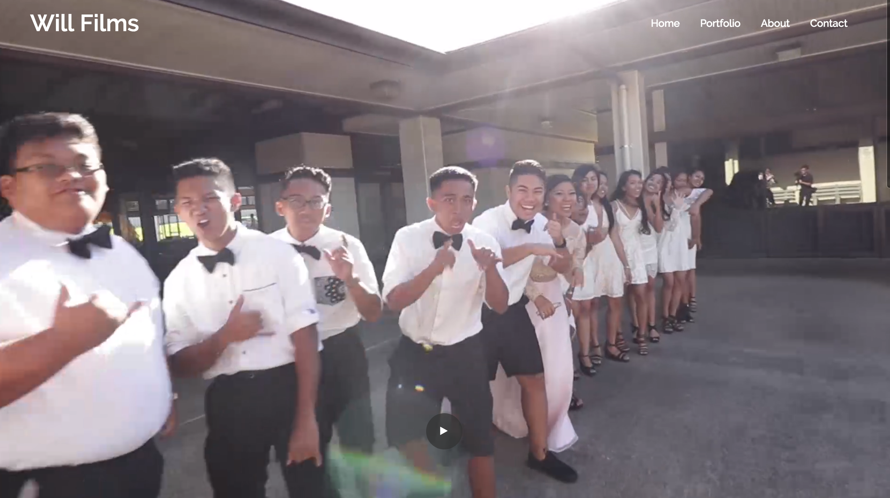
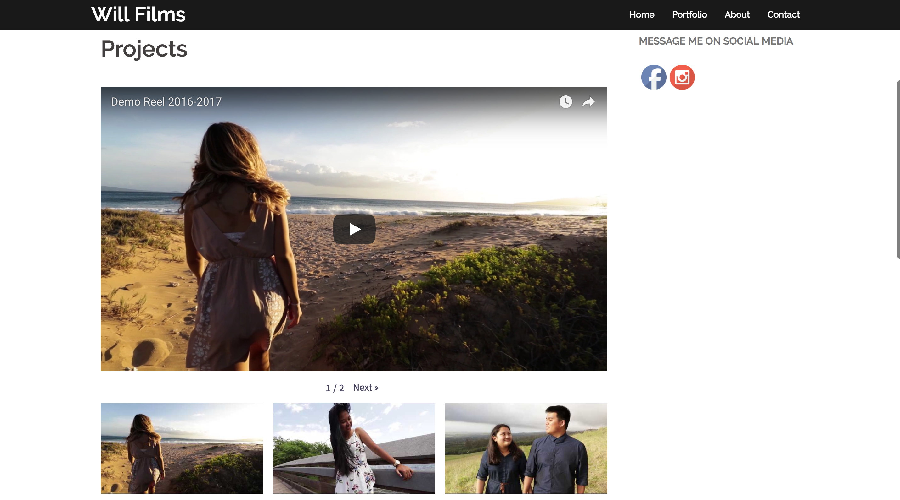

I work as a website assistant for the East Asian and Literature program at UH Manoa, and most of my tasks there involve updating the EALL website with Wordpress. I learned a lot while working as a website assistant about design, HTML, and wordpress itself, so I decided to use those skills and create a website of my own. 

In my spare time I like to shoot video for graduation parties and weddings. However the only way I could find work was through direct messages on Facebook or Instagram. I wasn't finding much clients as time went on, so I decided to create a website and also a business name to try to get more exposure. 

There were a lot more steps in creating a website than I had expected. Before I even started making the website, I had to get a domain name, and a web hosting service. Once I did all of that and got to the Wordpress dashboard everything felt a little more familiar. I mostly used the built-in editor for Wordpress and didn't directly change the HTML and CSS myself because I just needed something simple to display all of my video projects and contact information. My website's still a work in progress but all of the main components are there. As time goes on hopefully my website will be 100% done!

 
<a href="http://box5145.temp.domains/~willfil1/"><i class="large wordpress icon"></i>Check out my website here!</a>
